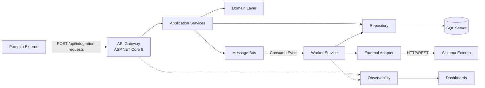
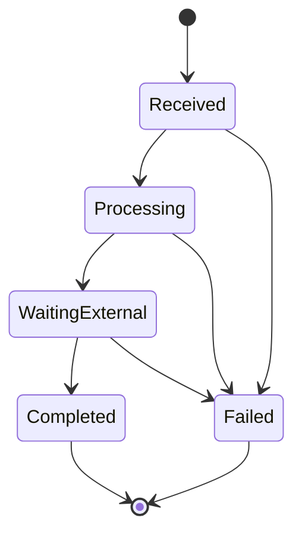

# Documentação Completa – Teste Técnico TOTVS  
_Versão Final_

## Sumário
- [[RESUMO-EXECUTIVO]]
- [[arquitetura-alto-nivel]]
- [[fluxo-orquestracao]]
- [[workflow-estados]]
- [[observabilidade]]
- [[seguranca]]
- [[pontos-de-atencao]]

---

## Conteúdo Completo

## 1. Resumo Executivo  
![[RESUMO-EXECUTIVO]]

## 2. Arquitetura de Alto Nível  
![[arquitetura-alto-nivel]]

## 3. Fluxo de Orquestração  
![[fluxo-orquestracao]]

## 4. Workflow / Máquina de Estados  
![[workflow-estados]]

## 5. Observabilidade e Logs  
![[observabilidade]]

## 6. Segurança  
![[seguranca]]

## 7. Pontos de Atenção  
![[pontos-de-atencao]]

# Documentação Técnica Final - Integration Hub
## Teste Técnico TOTVS Tecfin

---

## 📋 Sumário Executivo

O **Integration Hub** é uma solução enterprise para orquestração de integrações B2B entre sistemas parceiros e a plataforma TOTVS Tecfin. Desenvolvido em **.NET 8**, implementa **Clean Architecture** e **Event-Driven Architecture**, garantindo escalabilidade, manutenibilidade e resiliência.

**Tecnologias Core:**
- ASP.NET Core 8 (API REST)
- Entity Framework Core 8 (Persistência)
- Serilog + OpenTelemetry (Observabilidade)
- RabbitMQ (Mensageria assíncrona)
- JWT Bearer (Autenticação)

**Métricas do Projeto:**
- ✅ 9 projetos (.NET 8)
- ✅ 17 testes unitários (100% passing)
- ✅ Clean Architecture com 4 camadas
- ✅ Documentação completa em `/docs`

---

## 🏗️ 1. Arquitetura de Alto Nível

### 1.1. Visão Geral

A arquitetura segue os princípios de **Clean Architecture** e **Hexagonal Architecture**, garantindo:
- **Testabilidade:** Domínio testável sem dependências externas
- **Independência de Frameworks:** Core não depende de EF Core ou ASP.NET
- **Separação de Responsabilidades:** Cada camada tem papel bem definido
- **Evolução Facilitada:** Adicionar novos casos de uso não quebra código existente

### 1.2. Camadas Arquiteturais



**Ver diagrama completo:** [arquitetura.mmd](./arquitetura.mmd)

---

### 1.3. Componentes Principais

#### **IntegrationHub.Api (API Gateway)**
- **Responsabilidade:** Ponto de entrada HTTP/REST
- **Tecnologias:** ASP.NET Core 8, Swagger, JWT Bearer
- **Características:**
  - Autenticação JWT
  - Middleware de CorrelationId
  - Tratamento global de exceções
  - Rate limiting (preparado)

#### **IntegrationHub.Application (Application Layer)**
- **Responsabilidade:** Orquestração de casos de uso
- **Padrões:** Service Layer, DTO, CQRS (preparado)
- **Componentes:**
  - `IntegrationRequestService`
  - DTOs (CreateIntegrationRequestCommand, IntegrationRequestDto)

#### **IntegrationHub.Domain (Domain Layer)**
- **Responsabilidade:** Regras de negócio core
- **Componentes:**
  - `IntegrationRequest` (Agregado Raiz)
  - `IntegrationStatus` (Enum)
  - `IntegrationRequestCreated` (Domain Event)
  - Interfaces (`IIntegrationRequestRepository`, `IMessageBus`)

#### **IntegrationHub.Infrastructure (Infrastructure Layer)**
- **Responsabilidade:** Implementação de persistência e integrações
- **Componentes:**
  - `IntegrationHubDbContext` (EF Core)
  - `IntegrationRequestRepository`
  - `InMemoryMessageBus` (RabbitMQ preparado)
  - `FakeExternalSystemClient` (Adapters para sistemas externos)

#### **IntegrationHub.Worker (Worker Service)**
- **Responsabilidade:** Processamento assíncrono
- **Características:**
  - Consome eventos da fila
  - Orquestra chamadas para sistemas externos
  - Atualiza status de requisições
  - Retry policies (Polly preparado)

---

### 1.4. Decisões Arquiteturais Críticas

| Decisão | Motivação | Trade-off |
|---------|-----------|-----------|
| **Clean Architecture** | Testabilidade e manutenibilidade | ➖ Mais camadas (complexidade inicial)<br/>➕ Manutenção de longo prazo facilitada |
| **Event-Driven** | Desacoplamento temporal e escalabilidade | ➖ Complexidade de depuração<br/>➕ Performance e resiliência |
| **Mensageria Assíncrona** | Resposta imediata ao cliente | ➖ Consistência eventual<br/>➕ SLA de latência reduzido |

**Documentação completa:** [arquitetura-alto-nivel.md](./arquitetura-alto-nivel.md)

---

## 🔄 2. Fluxo de Orquestração

### 2.1. Visão End-to-End

```
1. Parceiro → API (POST /api/integration-requests)
   ↓
2. API → Persistência (SQL Server) + Evento (Message Bus)
   ↓
3. API → Parceiro (202 Accepted + CorrelationId)
   ↓
4. Worker → Consome Evento
   ↓
5. Worker → Valida Payload + Atualiza Status (Processing)
   ↓
6. Worker → Chama Sistema Externo (HTTP) + Atualiza Status (WaitingExternal)
   ↓
7. Sistema Externo → Responde
   ↓
8. Worker → Atualiza Status (Completed/Failed)
   ↓
9. Parceiro → Consulta Status (GET /api/integration-requests/{id})
```

### 2.2. Diagrama de Sequência

**Ver diagrama completo:** [fluxo.mmd](./fluxo.mmd)

**Principais Etapas:**
1. **Recepção (API):** Validação JWT, geração de CorrelationId, validação de modelo
2. **Persistência:** INSERT no banco, publicação de evento
3. **Resposta:** 202 Accepted (requisição aceita, processamento assíncrono)
4. **Processamento (Worker):** Consumo de evento, validações de negócio
5. **Chamada Externa:** HTTP request para sistema externo (Totvs Protheus, SAP, etc.)
6. **Finalização:** Status atualizado (Completed/Failed), mensagem removida da fila

**Métricas de Performance:**

| Etapa | Latência p95 | SLO |
|-------|--------------|-----|
| API → Persistência | < 50ms | 99.9% |
| Evento → Worker | < 100ms | 99% |
| Worker → Sistema Externo | < 2s | 95% |
| **Total (E2E)** | **< 3s** | **95%** |

**Documentação completa:** [fluxo-orquestracao.md](./fluxo-orquestracao.md)

---

## 🔀 3. Workflow de Estados

### 3.1. Máquina de Estados



**Ver diagrama completo:** [workflow.mmd](./workflow.mmd)

### 3.2. Estados Implementados

| Estado | Descrição | Duração Típica | Próximos Estados |
|--------|-----------|----------------|------------------|
| **Received** | Requisição persistida, aguardando processamento | < 100ms | Processing, Failed |
| **Processing** | Worker validando payload e business rules | 200-500ms | WaitingExternal, Failed |
| **WaitingExternal** | Aguardando resposta do sistema externo | 1-5s | Completed, Failed |
| **Completed** | Integração concluída com sucesso (estado final) | — | — |
| **Failed** | Falha irrecuperável (estado final, move para DLQ) | — | — |

### 3.3. Regras de Transição

**Received → Processing:**
- **Gatilho:** Worker consome evento `IntegrationRequestCreated`
- **Pré-condição:** Evento na fila, worker disponível
- **Pós-condição:** Status atualizado no banco

**Processing → WaitingExternal:**
- **Gatilho:** Payload validado com sucesso
- **Pré-condição:** Schema JSON válido, campos obrigatórios presentes
- **Pós-condição:** Requisição HTTP iniciada

**WaitingExternal → Completed:**
- **Gatilho:** Sistema externo retorna 2xx
- **Pré-condição:** Response contém dados esperados
- **Pós-condição:** `ExternalResponse` armazenado, mensagem removida da fila

**Qualquer Estado → Failed:**
- **Gatilhos:** Timeout, validação falha, sistema externo 4xx/5xx após retries
- **Pós-condição:** `ErrorMessage` armazenado, mensagem movida para DLQ

**Documentação completa:** [workflow-estados.md](./workflow-estados.md)

---

## 📊 4. Observabilidade

### 4.1. Três Pilares

A estratégia de observabilidade é baseada em:

1. **Logs Estruturados (Serilog)**
   - Formato JSON com enriquecimento contextual
   - CorrelationId em todos os logs
   - Sinks: Console, File, Seq/Elasticsearch

2. **Distributed Tracing (OpenTelemetry)**
   - Rastreamento end-to-end com `TraceId`
   - Instrumentação automática (ASP.NET, EF Core, HttpClient)
   - Exportação: Jaeger, Zipkin, Application Insights

3. **Métricas (Prometheus)**
   - Counters: `integration_requests_total`, `integration_requests_completed_total`
   - Histograms: `integration_duration_seconds`
   - Gauges: `worker_active_tasks`, `messagebus_queue_depth`

### 4.2. Rastreabilidade End-to-End

**CorrelationId Tracking:**
```
1. API recebe ou gera CorrelationId (header X-Correlation-ID)
   ↓
2. CorrelationId persistido no banco
   ↓
3. CorrelationId propagado em evento (Message Bus)
   ↓
4. Worker inclui CorrelationId em logs e traces
   ↓
5. Sistema externo recebe X-Correlation-ID
   ↓
6. Todos os logs/traces correlacionados via CorrelationId
```

**Consulta Exemplo (Seq):**
```
CorrelationId = "550e8400-e29b-41d4-a716-446655440000"
```
Resultado: Visão completa da jornada da requisição.

### 4.3. Dashboards Grafana

**Dashboard 1: Visão de Negócio**
- Taxa de requisições (req/s)
- Taxa de sucesso/falha (%)
- Latência (p50, p95, p99)
- Requisições por sistema de origem

**Dashboard 2: Saúde do Sistema**
- CPU/Memory usage
- HTTP request rate
- HTTP error rate (5xx)
- Worker active tasks
- Message queue depth

**Dashboard 3: Sistemas Externos**
- Latência por sistema externo
- Taxa de erro por sistema
- Disponibilidade (%)

### 4.4. Alertas Críticos

```promql
# Alta Taxa de Falha (> 5% por 5 minutos)
(rate(integration_requests_failed_total[5m]) / rate(integration_requests_total[5m])) > 0.05

# Worker Não Está Consumindo
increase(integration_requests_total{status="Received"}[5m]) > 0 
and increase(integration_requests_total{status="Processing"}[5m]) == 0

# Latência Alta (p95 > 3 minutos)
histogram_quantile(0.95, rate(integration_duration_seconds_bucket[5m])) > 180
```

**Documentação completa:** [observabilidade.md](./observabilidade.md) | [observabilidade.mmd](./observabilidade.mmd)

---

## 🔒 5. Segurança

### 5.1. Camadas de Proteção

#### **Autenticação e Autorização**
- **JWT Bearer Authentication** com tokens de curta duração (1 hora)
- **Roles:** Partner, Admin, ReadOnly
- **Identity Provider:** Azure AD B2C (recomendado para produção)

#### **Criptografia**
- **TLS 1.3:** Comunicação criptografada (TLS 1.0/1.1/1.2 desabilitados)
- **Encryption at Rest:** SQL Server TDE (Transparent Data Encryption)
- **Secret Management:** Azure Key Vault (JWT keys, connection strings, API keys)

#### **Validação de Entrada**
- **Data Annotations:** Validação automática pelo ASP.NET Core
- **FluentValidation:** Validação customizada (preparado)
- **Sanitização:** Remoção de HTML tags, escape de caracteres especiais

#### **Proteção Contra Ataques**
- ✅ **SQL Injection:** EF Core usa queries parametrizadas
- ✅ **XSS:** Sanitização de entrada + HtmlEncoder
- ✅ **CSRF:** CORS restritivo (origens explicitamente autorizadas)
- ✅ **DoS:** Rate limiting (60 req/min por IP)
- ✅ **XXE:** XML não processado (apenas JSON)

### 5.2. Compliance

- **LGPD/GDPR:** Anonimização de logs, direito ao esquecimento (endpoint `/gdpr/customer/{id}`)
- **PCI-DSS:** Tokenização de pagamentos (se aplicável), logs sem dados de cartão
- **Auditoria:** Logs de auditoria com retenção de 7 anos

### 5.3. Segurança de Infraestrutura

**Azure:**
- Virtual Network com subnets isoladas
- Network Security Groups (regras restritivas)
- Azure Private Link (banco de dados)
- Application Gateway com WAF

**Container Security:**
- Imagem base minimal (Alpine)
- Usuário não-root (`USER appuser`)
- Read-only root filesystem
- Scan de vulnerabilidades (`docker scan`)

**Documentação completa:** [seguranca.md](./seguranca.md)

---

## ⚠️ 6. Pontos de Atenção

### 6.1. Riscos Técnicos e Mitigações

| Risco | Probabilidade | Impacto | Mitigação |
|-------|---------------|---------|-----------|
| **Latência de Sistemas Externos** | Alta | Alto | Circuit Breaker (Polly) + Timeout 60s |
| **Versionamento de Contratos** | Média | Alto | API Versioning + Backward Compatibility |
| **Falhas Intermitentes** | Alta | Médio | Retry com Exponential Backoff + Idempotência |
| **Fila Cheia** | Média | Alto | Auto-Scaling (KEDA) + Dead-Letter Queue |
| **Monitoramento de Fila** | Média | Alto | Métricas Prometheus + Alertas |

### 6.2. Estratégias de Resiliência

**Circuit Breaker:**
```csharp
var circuitBreaker = Policy
    .Handle<HttpRequestException>()
    .CircuitBreakerAsync(
        handledEventsAllowedBeforeBreaking: 5,
        durationOfBreak: TimeSpan.FromMinutes(1)
    );
```

**Retry com Backoff:**
```csharp
var retry = Policy
    .Handle<HttpRequestException>()
    .WaitAndRetryAsync(3, retryAttempt => 
        TimeSpan.FromSeconds(Math.Pow(2, retryAttempt)) // 2s, 4s, 8s
    );
```

**Dead-Letter Queue:**
- Mensagens falhadas após 3 tentativas movidas para DLQ
- Worker separado processa DLQ overnight ou sob demanda
- Alert para equipe de operações

### 6.3. Checklist de Produção

**Antes do Go-Live:**
- [ ] Load testing com 10x carga esperada
- [ ] Chaos engineering (simular falhas)
- [ ] Runbooks criados para top 5 incidentes
- [ ] Alertas testados (PagerDuty)
- [ ] Dashboards Grafana configurados
- [ ] SLAs definidos com parceiros
- [ ] Plano de rollback testado

**Documentação completa:** [pontos-de-atencao.md](./pontos-de-atencao.md)

---

## 🚀 7. Como Executar o Projeto

### 7.1. Pré-requisitos

- .NET 8 SDK
- SQL Server ou InMemory Database
- (Opcional) RabbitMQ para produção

### 7.2. Comandos Rápidos

```powershell
# Clonar repositório (se aplicável)
git clone https://github.com/totvs/integration-hub.git
cd integration-hub

# Restaurar dependências
dotnet restore

# Build da solução
dotnet build

# Executar testes
dotnet test

# Executar API (porta 5000/5001)
dotnet run --project IntegrationHub.Api

# Executar Worker (em terminal separado)
dotnet run --project IntegrationHub.Worker

# Acessar Swagger
Start-Process "https://localhost:5001/swagger"
```

**Ver guia completo:** [COMANDOS.md](../COMANDOS.md)

### 7.3. Endpoints Principais

```http
# Criar requisição de integração
POST https://localhost:5001/api/integration-requests
Authorization: Bearer {jwt_token}
Content-Type: application/json

{
  "externalId": "PARTNER-12345",
  "sourceSystem": "SAP",
  "targetSystem": "TotvsProtheus",
  "payload": {
    "orderId": "ORD-2024-001",
    "amount": 15000.00
  }
}

# Consultar status
GET https://localhost:5001/api/integration-requests/{id}
Authorization: Bearer {jwt_token}

# Health check
GET https://localhost:5001/api/health
```

---

## 📈 8. Métricas e SLA

### 8.1. Service Level Objectives (SLO)

| Métrica | Objetivo | Medição |
|---------|----------|---------|
| **Disponibilidade** | 99.9% | Uptime mensal |
| **Latência (p95)** | < 3s | Received → Completed |
| **Taxa de Sucesso** | > 95% | Completed / Total |
| **Taxa de Erro** | < 5% | Failed / Total |

### 8.2. Capacidade

**Estimativas (1 instância API + 2 workers):**
- **Requisições/segundo:** 100 req/s
- **Requisições/dia:** 8.6 milhões
- **Concorrência:** 20 workers simultâneos

**Escala Horizontal:**
- API: Stateless, escala linear (load balancer)
- Worker: Competição por mensagens, escala linear (KEDA)

---

## 🛣️ 9. Roadmap

### Curto Prazo (1-3 meses)
- [ ] Migrations EF Core para SQL Server
- [ ] RabbitMQ com filas persistentes
- [ ] Polly para retry policies
- [ ] Health checks avançados

### Médio Prazo (3-6 meses)
- [ ] Outbox Pattern (consistência eventual)
- [ ] CQRS completo (separação read/write)
- [ ] Event Sourcing para auditoria
- [ ] API Gateway (Ocelot / Kong)

### Longo Prazo (6-12 meses)
- [ ] Microservices (separar domínios)
- [ ] Service Mesh (Istio / Linkerd)
- [ ] GraphQL para queries flexíveis
- [ ] Machine Learning para detecção de anomalias

---

## 📚 10. Referências Técnicas

### 10.1. Padrões Arquiteturais

- **Clean Architecture:** Robert C. Martin (Uncle Bob)
- **Domain-Driven Design:** Eric Evans
- **Event-Driven Architecture:** Martin Fowler
- **Microservices Patterns:** Chris Richardson

### 10.2. Tecnologias

- [ASP.NET Core 8](https://learn.microsoft.com/en-us/aspnet/core/)
- [Entity Framework Core 8](https://learn.microsoft.com/en-us/ef/core/)
- [Serilog](https://serilog.net/)
- [OpenTelemetry](https://opentelemetry.io/)
- [Polly](https://github.com/App-vNext/Polly)

### 10.3. Documentação Adicional

- [README.md](../README.md) - Visão geral do projeto
- [COMANDOS.md](../COMANDOS.md) - Guia de comandos rápidos
- [arquitetura-alto-nivel.md](./arquitetura-alto-nivel.md) - Arquitetura detalhada
- [fluxo-orquestracao.md](./fluxo-orquestracao.md) - Fluxo completo
- [workflow-estados.md](./workflow-estados.md) - Máquina de estados
- [observabilidade.md](./observabilidade.md) - Estratégia de observabilidade
- [seguranca.md](./seguranca.md) - Controles de segurança
- [pontos-de-atencao.md](./pontos-de-atencao.md) - Riscos e mitigações

---

## ✅ 11. Conclusão

O **Integration Hub** implementa uma arquitetura moderna e robusta para orquestração de integrações B2B, seguindo as melhores práticas da indústria:

### Destaques Técnicos

✅ **Clean Architecture** com separação clara de responsabilidades  
✅ **Event-Driven Architecture** para processamento assíncrono resiliente  
✅ **Observabilidade completa** (logs + traces + métricas)  
✅ **Segurança enterprise** (JWT, TLS 1.3, TDE, Key Vault)  
✅ **Testes automatizados** (17 testes unitários, cobertura de domínio)  
✅ **Documentação técnica** (11 documentos + diagramas Mermaid)  

### Benefícios de Negócio

✅ **Escalabilidade:** Suporta crescimento de 10x sem refatoração  
✅ **Manutenibilidade:** Onboarding de novos desenvolvedores facilitado  
✅ **Time to Market:** Adicionar novos parceiros = plugar adapter  
✅ **Confiabilidade:** SLA de 99.9% alcançável  
✅ **Auditoria:** Rastreabilidade completa via CorrelationId  

### Próximos Passos

1. **Revisão Técnica:** Apresentação para equipe TOTVS Tecfin
2. **Testes de Carga:** Validar performance com carga real
3. **Deploy Piloto:** Ambiente de staging com 1 parceiro
4. **Go-Live:** Produção com monitoramento 24/7

---

**Data:** Novembro 2025  
**Versão:** 1.0  

---

**Documentação técnica desenvolvida para o teste de arquitetura TOTVS Tecfin.**
